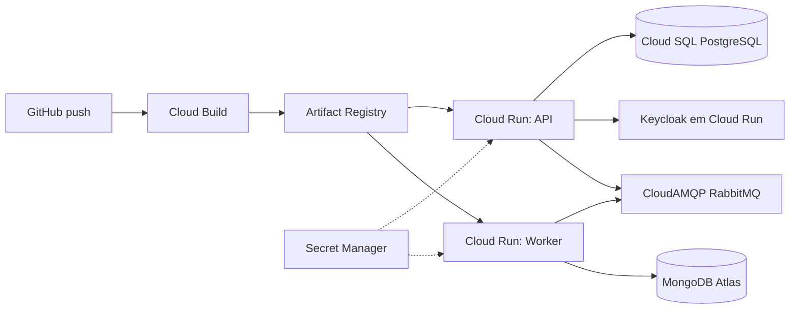

# Valid OS — Sistema de Gerenciamento de Ordens de Serviço

> Desafio técnico Valid — vaga Analista Desenvolvedor Sênior (.NET + React)

[](https://sonarcloud.io/summary/overall?id=FernandoMrq_teste_valid)
[](https://sonarcloud.io/summary/overall?id=FernandoMrq_teste_valid)
[](https://sonarcloud.io/summary/overall?id=FernandoMrq_teste_valid)
[](https://sonarcloud.io/summary/overall?id=FernandoMrq_teste_valid)
[](https://sonarcloud.io/summary/overall?id=FernandoMrq_teste_valid)

Dashboard público: <https://sonarcloud.io/summary/overall?id=FernandoMrq_teste_valid&branch=main>

## Descrição

Valid OS é um sistema de gestão de ordens de serviço (chamados) com autenticação delegada ao Keycloak, persistência relacional em PostgreSQL, registro de notificações em MongoDB e integração assíncrona via RabbitMQ. O backend segue Clean Architecture com domínio rico; o frontend é uma SPA React organizada por features, consumindo a API com JWT.

## Arquitetura

Clean Architecture em quatro camadas no backend, com domínio rico: entidades encapsulam invariantes e emitem **Domain Events**, despachados **após** o commit transacional para handlers que publicam **Integration Events** no broker quando o estado precisa ser comunicado fora do processo (por exemplo, fechamento de OS consumido pelo Worker).

```
                    ┌─────────────┐
                    │   Browser   │
                    │  (React SPA)│
                    └──────┬──────┘
                           │ HTTPS / JWT
              ┌────────────┴────────────┐
              │      Valid.OS.API       │
              │   (Controllers + JWT)  │
              └────────────┬────────────┘
                           │
              ┌────────────┴────────────┐
              │ Valid.OS.Application    │
              │ (App services, commands) │
              └─────┬──────────────┬────┘
                    │              │
         ┌──────────┴──┐    ┌──────┴──────────┐
         │   Domain    │    │ Infrastructure  │
         │ (entities,  │◄───│ EF, Mongo,      │
         │  events,    │    │ MassTransit,    │
         │  repos I/F)  │    │ Keycloak opts)  │
         └─────────────┘    └────────┬────────┘
                                       │
         ┌─────────────────────────────┼─────────────────────────┐
         │                             │                         │
   PostgreSQL                      RabbitMQ                   MongoDB
         │                             │                         │
         └─────────────────────────────┼─────────────────────────┘
                                       │
                              ┌────────┴────────┐
                              │ Valid.OS.Worker│
                              │ (consumers)    │
                              └────────────────┘
```

## Stack

- **Backend**: .NET 8, ASP.NET Core (controllers), EF Core 8 + Npgsql, MassTransit, FluentValidation, Serilog, Swashbuckle (OpenAPI), xUnit + FluentAssertions + NSubstitute
- **Frontend**: React 19, TypeScript 5, Vite 5, Tailwind CSS 3, Radix UI primitives, TanStack Query, Axios, React Hook Form + Zod, `keycloak-js`
- **Bancos**: PostgreSQL 16, MongoDB 7
- **Mensageria**: RabbitMQ 3.13 (management plugin)
- **Auth**: Keycloak 24 (OIDC + JWT Bearer na API)
- **Infra**: Docker Compose, GitHub Actions (build + testes)

## Patterns aplicados

- **Repository** — abstração de persistência por agregado; implementações na Infrastructure.
- **Unit of Work** — commit transacional; após `SaveChangesAsync`, dispatch de Domain Events.
- **Factory** — `UserFactory` e métodos estáticos `Create` nos agregados garantem invariantes na criação.
- **Value Object** — `Email` e `Document` (CPF/CNPJ) imutáveis, com validação estrutural.
- **Specification** — `ServiceOrderFilterSpecification` compõe predicados dinâmicos em `Expression<T>`.
- **Domain Events** — agregados sinalizam mudanças; handlers traduzem para Integration Events quando a mudança deve sair do processo.
- **Application Service** — uma classe por agregado orquestra repositório, UoW e domínio (termino canônico DDD / Evans).
- **Mapper (manual)** — classes estáticas por agregado (`ToDto` / `ToDetailsDto`); mapeamento explícito para code review.
- **Vertical Slice (frontend)** — `src/features/{feature}/`, com `shared/` para o que é genuinamente reutilizável.

## Pré-requisitos

- Docker Desktop (recomendado para subir stack completa)
- Opcional (desenvolvimento local da API ou do web sem Compose): .NET 8 SDK, Node.js 20+

## Como executar

### Stack completa (recomendado)

Na raiz do repositório:

```bash
docker compose up --build
```

Encerrar:

```bash
docker compose down
```

Se o seu Docker só expuser o binário legado, use `docker-compose` no lugar de `docker compose`.

Após os serviços subirem:

| Serviço | URL | Credenciais / notas |
|--------|-----|---------------------|
| API Swagger | http://localhost:5000/swagger | Use **Authorize** com JWT emitido pelo Keycloak |
| Health (readiness) | http://localhost:5000/health | Anônimo |
| Web (Vite) | http://localhost:5173 | Login via Keycloak |
| Keycloak Admin | http://localhost:8080 | `admin` / `admin` |
| RabbitMQ Management | http://localhost:15672 | `guest` / `guest` (padrão da imagem) |

Usuário de exemplo (realm importado): `admin@valid.local` / `admin`

### API e Worker na máquina (Compose só para dependências)

Na raiz, suba infraestrutura sem API, Worker nem Web:

```bash
docker compose up -d postgres mongo rabbitmq keycloak
```

Aguarde o Postgres ficar saudável e o Keycloak responder. A API aplica **migrations do EF Core automaticamente** na subida (`MigrateAsync`); não é obrigatório rodar `dotnet ef` antes.

API (na raiz):

```bash
dotnet restore valid-ordem-servico.sln
dotnet run --project src/Valid.OS.API/Valid.OS.API.csproj
```

Worker (outro terminal, na raiz):

```bash
dotnet run --project src/Valid.OS.Worker/Valid.OS.Worker.csproj
```

### Frontend (desenvolvimento)

Com Postgres, Keycloak e API acessíveis conforme `appsettings` / variáveis `VITE_*`:

```bash
cd frontend/valid-os-web
npm ci
npm run dev
```

Build de produção local:

```bash
cd frontend/valid-os-web
npm ci
npm run build
npm run preview
```

### Backend — build sem rodar

```bash
dotnet build valid-ordem-servico.sln -c Release
```

### O que o CI executa (reproduzir localmente)

Backend, na raiz:

```bash
dotnet restore valid-ordem-servico.sln
dotnet build valid-ordem-servico.sln -c Release --no-restore
dotnet test valid-ordem-servico.sln -c Release --no-build
```

Frontend:

```bash
cd frontend/valid-os-web
npm ci
npm run lint
npm run typecheck
npm run build
```

## Variáveis de ambiente

Valores padrão para desenvolvimento local: `src/Valid.OS.API/appsettings.json`. No Docker, `docker-compose.yml` injeta hosts e credenciais alinhados aos serviços da rede Compose.

| Área | Chave (config) | Descrição |
|------|-----------------|-----------|
| Postgres | `ConnectionStrings:Postgres` | Connection string Npgsql |
| Keycloak (API) | `Keycloak:Authority`, `Keycloak:Audience` | Emissão/validação JWT |
| Keycloak (issuer) | `Keycloak:ValidIssuer` | Opcional; necessário quando o issuer do token difere da authority interna (ex.: compose) |
| Mongo | `Mongo:ConnectionString`, `Mongo:DatabaseName` | Notificações persistidas pelo Worker |
| RabbitMQ | `RabbitMq:Host`, `RabbitMq:VHost`, `RabbitMq:User`, `RabbitMq:Password` | Publicação/consumo MassTransit |

**Frontend (Vite — prefixo `VITE_`):**

| Variável | Exemplo local | Uso |
|----------|----------------|-----|
| `VITE_API_URL` | `http://localhost:5000` | Base URL da API |
| `VITE_KEYCLOAK_URL` | `http://localhost:8080` | Base do Keycloak |
| `VITE_KEYCLOAK_REALM` | `valid-os` | Realm OIDC |
| `VITE_KEYCLOAK_CLIENT` | `valid-os-web` | Client público SPA |

## Endpoints (resumo)

Todos os endpoints abaixo exigem **Bearer JWT** válido, exceto `/health`.

| Método | Rota | Descrição |
|--------|------|-----------|
| GET | `/health` | Health checks (Postgres, Mongo, RabbitMQ, Keycloak) |
| GET | `/api/users/me` | JIT provisioning do usuário local + perfil |
| POST | `/api/clients` | Criar cliente |
| GET | `/api/clients` | Listar clientes (`page`, `pageSize`, `search`) |
| GET | `/api/clients/{id}` | Detalhe do cliente |
| POST | `/api/service-orders` | Criar OS |
| GET | `/api/service-orders` | Listar OS (`status`, `priority`, `clientId`, `page`, `pageSize`) |
| GET | `/api/service-orders/{id}` | Detalhe da OS |
| PUT | `/api/service-orders/{id}` | Atualizar descrição/prioridade |
| PATCH | `/api/service-orders/{id}/status` | Transição de status |
| GET | `/api/notifications` | Listar notificações (`page`, `pageSize`) |

Erros seguem **Problem Details** (`application/problem+json`); regras de negócio inválidas tendem a **422**, validação de entrada a **400**.

## Decisões técnicas (consolidado)

- **Clean Architecture (4 projetos + Worker + Contracts)** — domínio sem dependência de framework; Infrastructure implementa portas.
- **Monólito modular** — um deployable principal (`API`) + `Worker` para consumo assíncrono; sem microsserviços no escopo do desafio.
- **Domínio rico** — construtores privados, mutação por comportamentos, invariantes nos agregados.
- **Keycloak como IdP** — sem auth local por senha na API; a API valida JWT e provisiona usuário local no primeiro acesso.
- **Controllers** com `[ApiController]` — binding, ProblemDetails e filters globais (validação, usuário atual).
- **MassTransit + RabbitMQ** — publish/consume com retry; DLQ via configuração do transporte.
- **Specification pattern** — filtros de listagem de OS compostos sem explosão de `if` no repositório.
- **UoW + dispatcher pós-commit** — Domain Events só após persistência bem-sucedida.
- **Mapeamento manual** — sem AutoMapper; cada campo de DTO explícito no mapper.
- **FluentValidation** — validação de commands integrada ao pipeline.
- **Dois bancos por requisito** — Postgres transacional + Mongo para documentos de notificação.
- **Frontend feature-based** — vertical slice em `features/`, UI base em `shared/ui/` (Radix + Tailwind).
- **CI GitHub Actions** — `dotnet restore/build/test` na solution; no frontend `npm ci`, lint, typecheck e build.
- **Convenções** — um tipo público por arquivo (C# e TS); `record` para DTOs, commands e queries; commits no estilo Conventional Commits.

## Estrutura do projeto (resumo)

```
.
├── docker-compose.yml
├── valid-ordem-servico.sln
├── keycloak/
├── .github/workflows/ci.yml
├── src/
│   ├── Valid.OS.API/
│   ├── Valid.OS.Application/
│   ├── Valid.OS.Domain/
│   ├── Valid.OS.Infrastructure/
│   ├── Valid.OS.Worker/
│   └── Valid.OS.Contracts/
└── frontend/valid-os-web/
    └── src/
        ├── app/
        ├── features/
        ├── pages/
        └── shared/
```

## Testes e cobertura

Backend (xUnit + FluentAssertions + NSubstitute), na raiz:

```bash
dotnet test valid-ordem-servico.sln
```

Cobertura em OpenCover (mesmo formato consumido pelo SonarCloud no CI):

```bash
dotnet test valid-ordem-servico.sln -c Release \
  --collect:"XPlat Code Coverage" \
  --results-directory ./TestResults \
  -- DataCollectionRunSettings.DataCollectors.DataCollector.Configuration.Format=opencover
```

Frontend (Vitest + Testing Library):

```bash
cd frontend/valid-os-web
npm ci
npm run test
npm run test:coverage
```

## Qualidade de código

- **SonarCloud** configurado via `sonar-project.properties` na raiz; o job `sonar` do pipeline em `.github/workflows/ci.yml` executa após backend e frontend, consumindo cobertura OpenCover (.NET) e LCOV (JS/TS).
- **Conventional Commits** em pt-BR, commits atômicos por categoria (fix, refactor, chore, docs).
- **XML docs** habilitadas em `Valid.OS.API` e `Valid.OS.Contracts`, expostas no Swagger.
- **Healthchecks** para Postgres, Mongo, RabbitMQ e Keycloak no `docker-compose.yml`, com `depends_on: service_healthy` para a API.
- **Containers não-root** — API e Worker rodam com `USER app`.

## Limitações conhecidas

- **GCP**: o material na seção abaixo é **extra** (contexto do desafio / diferencial opcional). **Este repositório não tem deploy de produção** e não pretende usar GCP em produção — era só o desenho arquitetural de referência.
- **Email no IdP**: quando muda no Keycloak, `UserFactory.SyncKeycloakClaims` sinaliza a alteração mas não reemite o VO `Email` — ponto de extensão deliberado.

## GCP (material extra — sem produção neste projeto)

O desafio citava GCP como diferencial; a seção a seguir é **ilustrativa**, para documentar uma possível arquitetura em nuvem. **Não faz parte do caminho de produção deste projeto** (não há pipeline de deploy aqui e não há intenção de operar esta solução na GCP). Se outro time quiser evoluir o mesmo desenho, o diagrama e os bullets abaixo servem como ponto de partida.



- **Cloud Run** para API e Worker como serviços independentes (autoscaling, pay-per-use, cold start aceitável para o caso).
- **Cloud SQL for PostgreSQL** para o write model transacional; conexão via Cloud SQL Auth Proxy ou socket privado.
- **MongoDB Atlas** para notificações (ou **Firestore** se preferir nativo GCP).
- **CloudAMQP** (RabbitMQ gerenciado) para mensageria; alternativa nativa seria **Pub/Sub** com adapter MassTransit.
- **Secret Manager** para credenciais (DB, broker, Keycloak client secret).
- **Artifact Registry** para as imagens; **Cloud Build** disparado pelo GitHub constrói e publica.
- **Keycloak** em Cloud Run com banco dedicado no Cloud SQL e realm versionado via GitOps.

## Próximos passos (fora do escopo atual)

Itens deixados de fora por escopo: Outbox pattern, Event Sourcing, sagas, multi-tenancy, versionamento explícito da API, cache distribuído e autorização por papéis fina além de autenticação JWT.

## Autor

Fernando Marques — [LinkedIn](https://linkedin.com/in/fernandomrq) · [GitHub](https://github.com/FernandoMrq)
